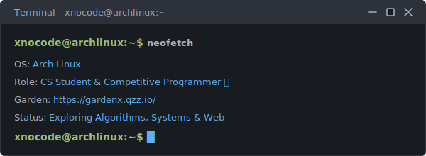

<div align="center">
  
</div>

<br/>

<!-- ══════════════════════  GITHUB STATS BADGES  ══════════════════════ -->
<div align="center">

  [](https://github.com/xnocode)&nbsp;
  [](https://github.com/xnocode?tab=followers)&nbsp;
  [](https://github.com/xnocode)&nbsp;
  [](https://github.com/xnocode?tab=repositories)

</div>

<br/>


<!-- ══════════════════════  SECTION 01 · GITHUB STATISTICS  ══════════════════════ -->

### 👾 GitHub Statistics

<picture decoding="async" loading="lazy">
  <source media="(prefers-color-scheme: light)" srcset="https://raw.githubusercontent.com/xnocode/xnocode/output/github-stats.png">
  <source media="(prefers-color-scheme: dark)"  srcset="https://raw.githubusercontent.com/xnocode/xnocode/output/github-stats-dark.png">
  
</picture>

<!-- ══════════════════════  SECTION 05 · WEEKLY CODING ACTIVITY  ══════════════════════ -->

### 📊 Weekly Coding Activity

<!--START_SECTION:waka-->

```txt
From: 15 July 2026 - To: 22 July 2026

Markdown     7 hrs 3 mins          ⣿⣿⣿⣿⣿⣿⣿⣿⣿⣿⣿⣿⣿⣿⣿⣷⣀⣀⣀⣀⣀⣀⣀⣀⣀   63.38 %
Other        2 hrs 8 mins          ⣿⣿⣿⣿⣷⣀⣀⣀⣀⣀⣀⣀⣀⣀⣀⣀⣀⣀⣀⣀⣀⣀⣀⣀⣀   19.18 %
TypeScript   1 hr 35 mins          ⣿⣿⣿⣦⣀⣀⣀⣀⣀⣀⣀⣀⣀⣀⣀⣀⣀⣀⣀⣀⣀⣀⣀⣀⣀   14.22 %
CSS          15 mins               ⣦⣀⣀⣀⣀⣀⣀⣀⣀⣀⣀⣀⣀⣀⣀⣀⣀⣀⣀⣀⣀⣀⣀⣀⣀   02.32 %
Bash         5 mins                ⣄⣀⣀⣀⣀⣀⣀⣀⣀⣀⣀⣀⣀⣀⣀⣀⣀⣀⣀⣀⣀⣀⣀⣀⣀   00.89 %
```

<!--END_SECTION:waka-->

<br/>

<!-- ══════════════════════  SECTION 02 · CONNECT & PROFILES  ══════════════════════ -->

### 🌐 Connect & Profiles

<p align="center">
  <a href="https://github.com/xnocode"></a>&nbsp;
  <a href="https://gardenx.qzz.io/"></a>&nbsp;
  <a href="https://codeforces.com/profile/xnocode"></a>&nbsp;
  <a href="https://atcoder.jp/users/xnocoder"></a>&nbsp;
  <a href="https://yukicoder.me/"></a>
</p>


<!-- ══════════════════════  SECTION 03 · MY GARDEN  ══════════════════════ -->

### 🌱 My Garden

> I maintain a personal website at **[gardenx.qzz.io](https://gardenx.qzz.io/)** where I write and publish my own notes, study logs, and thoughts — like a public personal diary.


<!-- ══════════════════════  SECTION 04 · LANGUAGES & TECHNOLOGIES  ══════════════════════ -->

### 🛠️ Languages & Technologies


<!-- ══════════════════════  SECTION 06 · THE READING CORNER  ══════════════════════ -->

### 📖 The Reading Corner

<table align="center">
  <tr>
    <td align="center" width="110"> <br/><sub><b>Duranta Eagle</b></sub> </td>
    <td align="center" width="110"> <br/><sub><b>Dracula</b></sub> </td>
    <td align="center" width="110"> <br/><sub><b>The Mystery of Marie Roget</b></sub> </td>
    <td align="center" width="110"> <br/><sub><b>The Philosophers Stone</b></sub> </td>
    <td align="center" width="110"> <br/><sub><b>The Adventure of the Naval Treaty</b></sub> </td>
  </tr>
  <tr>
    <td align="center" width="110"> <br/><sub><b>Hamlet</b></sub> </td>
    <td align="center" width="110"> <br/><sub><b>The Adventure of the Devils Foot</b></sub> </td>
    <td align="center" width="110"> <br/><sub><b>Crafting Interpreters</b></sub> </td>
    <td align="center" width="110"> <br/><sub><b>The Alchemist</b></sub> </td>
    <td align="center" width="110"> <br/><sub><b>Dark Psychology and Mind Control</b></sub> </td>
  </tr>
</table>


